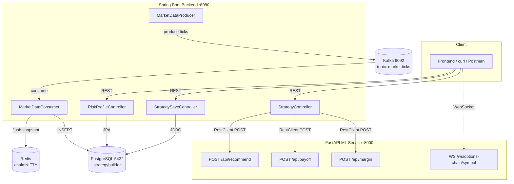
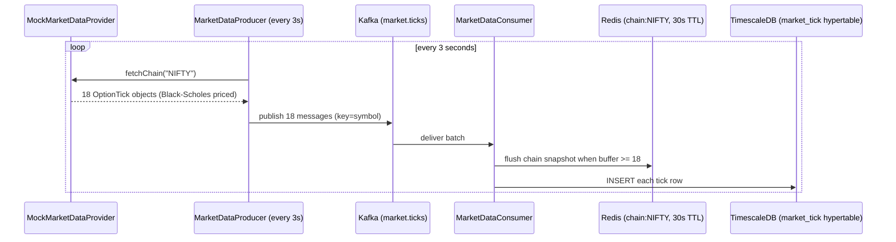
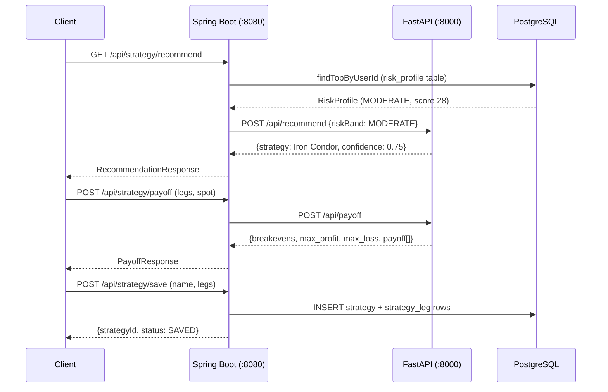

# Strategy Builder — Moneylogix

An options strategy builder platform that profiles a user's risk appetite, recommends option strategies, streams live options-chain data, and calculates payoff diagrams and margin requirements.

Repo: [Ananya-patel/Strategy_builder_moneylogix](https://github.com/Ananya-patel/Strategy_builder_moneylogix)

---

## Table of Contents

- [Architecture](#architecture)
- [Tech Stack](#tech-stack)
- [Project Structure](#project-structure)
- [Prerequisites](#prerequisites)
- [Setup & Run](#setup--run)
- [API Reference](#api-reference)
- [Data Flow Diagrams](#data-flow-diagrams)
- [Build Progress](#build-progress)
- [Troubleshooting](#troubleshooting)
- [Git Workflow](#git-workflow)

---

## Architecture



**Three components working together:**

1. **Spring Boot backend (:8080)** — owns all persistence via Flyway-migrated PostgreSQL schema, exposes REST APIs, proxies payoff/margin/recommendation compute to the Python ML service via `RestClient`.
2. **FastAPI ML service (:8000)** — stateless numeric engine for payoff curves, margin estimation, strategy recommendation, and a simulated live options-chain WebSocket feed.
3. **Kafka → Redis pipeline** — `MarketDataProducer` simulates live option ticks every 3 seconds using Black-Scholes math, publishes to Kafka topic `market.ticks`, `MarketDataConsumer` fans out to Redis (hot cache for instant reads) and TimescaleDB hypertable (historical tick storage).

---

## Tech Stack

| Layer | Technology |
|---|---|
| Backend | Java 25, Spring Boot 4.1.0, Spring Data JPA, Spring Data Redis, Spring Kafka, Spring Security (dev-mode) |
| ML / Compute service | Python, FastAPI, NumPy, Pydantic, Uvicorn |
| Database | PostgreSQL 16 via TimescaleDB (hypertable for tick data) |
| Schema migrations | Flyway 12 (5 versioned migrations, explicit Bean wiring) |
| Cache | Redis 7 — `chain:NIFTY` key, 30-second TTL |
| Event streaming | Apache Kafka 4.2 (KRaft mode, no Zookeeper) |
| Build | Maven, Docker Compose |

---

## Project Structure

```
strategy-builder/
├── backend/
│   ├── src/main/java/com/moneylogix/strategybuilder/
│   │   ├── StrategyBuilderBackendApplication.java
│   │   ├── common/
│   │   │   ├── SecurityConfig.java         # Spring Security disabled for dev
│   │   │   └── MlClientConfig.java         # RestClient bean → ML service
│   │   ├── riskprofile/
│   │   │   ├── RiskProfile.java            # JPA entity (@Entity, UUID PK)
│   │   │   ├── RiskBand.java               # enum CONSERVATIVE/MODERATE/AGGRESSIVE
│   │   │   ├── RiskProfileController.java  # POST /api/risk-profile, GET /api/risk-profile/me
│   │   │   ├── RiskProfileRepository.java  # JPA repo, findTopByUserIdOrderByCreatedAtDesc
│   │   │   ├── RiskProfileRequest.java
│   │   │   ├── RiskProfileResponse.java
│   │   │   └── RiskProfileService.java     # weighted scoring engine
│   │   ├── strategy/
│   │   │   ├── StrategyController.java     # GET /api/strategy/recommend
│   │   │   ├── StrategySaveController.java # POST /api/strategy/save, GET /api/strategy/my-strategies
│   │   │   └── StrategySaveRequest.java
│   │   └── marketdata/
│   │       ├── KafkaConfig.java            # @EnableKafka, ProducerFactory, ConsumerFactory
│   │       ├── MarketDataProvider.java     # interface (adapter pattern)
│   │       ├── MockMarketDataProvider.java # Black-Scholes tick generator
│   │       ├── MarketDataProducer.java     # @Scheduled every 3s → Kafka
│   │       ├── MarketDataConsumer.java     # @KafkaListener → Redis + TimescaleDB
│   │       └── OptionTick.java             # DTO
│   ├── src/main/resources/
│   │   ├── application.yml
│   │   └── db/migration/
│   │       ├── V1__create_core_tables.sql
│   │       ├── V2__create_recommendations.sql
│   │       ├── V3__create_strategies.sql
│   │       ├── V4__create_market_ticks_hypertable.sql
│   │       └── V5__add_retention_policy.sql
│   └── pom.xml
├── ml-service/
│   └── main.py                             # recommend, payoff, margin, WS endpoints
├── docker-compose.yml                      # Postgres/Timescale, Redis, Kafka (KRaft)
└── README.md
```

---

## Prerequisites

- **Java 17+** (tested on Java 25)
- **Maven** (bundled via `mvnw.cmd`)
- **Python 3.10+** with pip
- **Docker Desktop** — runs Postgres/TimescaleDB, Redis, Kafka as containers

---

## Setup & Run

### 1. Start Docker Desktop, then bring up infrastructure

```cmd
cd C:\path\to\strategy-builder
docker compose up -d
docker compose ps
```

All three containers should show `Up`: `sb-postgres`, `sb-redis`, `sb-kafka`.

If disk space is low, clean up unused Docker data first:

```cmd
docker system prune -f
docker volume prune -f
```

### 2. Start the ML service

```cmd
cd ml-service
pip install fastapi uvicorn numpy pydantic
python -m uvicorn main:app --port 8000
```

Verify:

```cmd
curl http://localhost:8000/health
```

Expected: `{"status":"ok"}`

### 3. Start the Spring Boot backend

```cmd
cd backend
set MAVEN_OPTS=-Xmx512m
mvn spring-boot:run
```

Watch for these lines confirming everything is wired:

```
Started StrategyBuilderBackendApplication
Published 18 ticks for NIFTY
Flushed chain snapshot to Redis: chain:NIFTY
```

Flyway runs all 5 migrations automatically on first startup. On subsequent startups it validates and skips.

### 4. Re-seed the demo risk profile after a fresh start

The database persists across Docker restarts via a named volume, but if the volume was recreated, re-run:

```cmd
curl -X POST http://localhost:8080/api/risk-profile -H "Content-Type: application/json" -d "{\"answers\":{\"loss_tolerance\":2,\"drawdown_reaction\":2,\"investment_horizon\":3,\"income_stability\":3,\"prior_experience\":2,\"goal\":2}}"
```

---

## API Reference

### Risk Profile

**POST** `/api/risk-profile` — submit 6-question quiz answers, returns scored risk band.

```cmd
curl -X POST http://localhost:8080/api/risk-profile ^
  -H "Content-Type: application/json" ^
  -d "{\"answers\":{\"loss_tolerance\":2,\"drawdown_reaction\":2,\"investment_horizon\":3,\"income_stability\":3,\"prior_experience\":2,\"goal\":2}}"
```

Response:

```json
{"id":"...","userId":"11111111-1111-1111-1111-111111111111","riskBand":"MODERATE","score":28,"createdAt":"..."}
```

**Weighted scoring logic** (in `RiskProfileService.calculateScore`):

| Question | Weight | Rationale |
|---|---|---|
| loss_tolerance | 3 | Strongest predictor of real trading behaviour under stress |
| drawdown_reaction | 3 | Reveals panic-selling tendency |
| investment_horizon | 2 | Affects which strategies are viable |
| income_stability | 2 | Determines capital availability |
| prior_experience | 1 | Informational only |
| goal | 1 | Informational only |

Max score = 48. Bands: CONSERVATIVE (0–20), MODERATE (21–36), AGGRESSIVE (37–48).

**GET** `/api/risk-profile/me` — returns most recent saved profile for demo user.

```cmd
curl http://localhost:8080/api/risk-profile/me
```

---

### Strategy Recommendation

**GET** `/api/strategy/recommend` — looks up saved risk profile, calls ML service, returns recommended strategy.

```cmd
curl http://localhost:8080/api/strategy/recommend
```

Risk band → strategy mapping (in `ml-service/main.py`):

| Risk Band | Strategy | Rationale |
|---|---|---|
| CONSERVATIVE | Covered Call | Defined risk, income-generating, suits low-volatility preference |
| MODERATE | Iron Condor | Defined risk on both sides, profits in range-bound markets |
| AGGRESSIVE | Long Straddle | Profits from large moves either direction, unlimited upside |

---

### Payoff Diagram

**POST** `/api/strategy/payoff` — computes payoff curve, breakeven(s), max profit and max loss for any multi-leg strategy.

```cmd
curl -X POST http://localhost:8080/api/strategy/payoff ^
  -H "Content-Type: application/json" ^
  -d "{\"legs\":[{\"option_type\":\"call\",\"position\":\"sell\",\"strike\":24900,\"premium\":45,\"quantity\":1},{\"option_type\":\"call\",\"position\":\"buy\",\"strike\":25000,\"premium\":20,\"quantity\":1}],\"current_spot\":24800}"
```

Response:

```json
{
  "breakevens": [24924.75],
  "max_profit": 25.0,
  "max_loss": -75.0,
  "spot_prices": [22320.0, "...", 27280.0],
  "payoff": [-75.0, "...", 25.0]
}
```

Leg shape: `{"option_type": "call|put", "position": "buy|sell", "strike": 24900, "premium": 45, "quantity": 1}`

---

### Margin Estimator

**POST** `/api/strategy/margin` — estimates required margin using defined-risk detection.

```cmd
curl -X POST http://localhost:8080/api/strategy/margin ^
  -H "Content-Type: application/json" ^
  -d "{\"legs\":[{\"option_type\":\"call\",\"position\":\"sell\",\"strike\":24900,\"premium\":45,\"quantity\":1},{\"option_type\":\"call\",\"position\":\"buy\",\"strike\":25000,\"premium\":20,\"quantity\":1}],\"current_spot\":24800}"
```

Response:

```json
{"is_defined_risk":true,"margin_required":75.0,"max_loss":-75.0,"method":"max_loss"}
```

**Methodology (approximation — not real SPAN):**
- Defined-risk positions (spreads, condors): `margin = abs(max_loss)` — mirrors actual exchange treatment of spread margin.
- Undefined-risk (naked shorts): `margin = (15% + 3%) × notional − premium collected`, floored at 5% of notional. Standard retail-broker heuristic.
- Risk type auto-detected by checking if payoff keeps worsening at ±50% spot range edges.

---

### Strategy Save / Load

**POST** `/api/strategy/save` — persists a named strategy with legs to PostgreSQL.

```cmd
curl -X POST http://localhost:8080/api/strategy/save ^
  -H "Content-Type: application/json" ^
  -d "{\"name\":\"My Iron Condor\",\"underlyingSymbol\":\"NIFTY\",\"legs\":[{\"optionType\":\"CALL\",\"action\":\"SELL\",\"strikePrice\":25000,\"expiryDate\":\"2026-07-31\",\"quantity\":1,\"premium\":45.0}]}"
```

Response: `{"strategyId":"...","status":"SAVED"}`

**GET** `/api/strategy/my-strategies` — lists all saved strategies for demo user.

```cmd
curl http://localhost:8080/api/strategy/my-strategies
```

---

### Live Options Chain (Kafka → Redis)

The backend continuously generates simulated option chain data:

```cmd
docker exec sb-redis redis-cli GET chain:NIFTY
```

Returns a JSON array of 18 option ticks (9 strikes × CALL + PUT), refreshed every ~3 seconds. Each tick includes: `symbol`, `strikePrice`, `optionType`, `ltp`, `openInterest`, `impliedVolatility`, `volume`.

**WebSocket (FastAPI):** `ws://localhost:8000/ws/options-chain/{symbol}` — streams a formatted chain payload every 1.5s including spot price.

---

## Data Flow Diagrams

### Kafka → Redis market data pipeline



### Request flow: recommend → payoff → save



---

## Build Progress

| Step | Feature | Status |
|---|---|---|
| 1 | Project scaffold (Spring Boot + React + FastAPI + Docker Compose) | ✅ Done |
| 2 | Database schema — 5 Flyway migrations, TimescaleDB hypertable, retention policy | ✅ Done |
| 3 | Market data adapter — Kafka pipeline, Redis cache, MockMarketDataProvider (Black-Scholes) | ✅ Done |
| 4 | Risk profile API — weighted scoring, save/get endpoints | ✅ Done |
| 5 | ML service — FastAPI recommendation stub with real API contract | ✅ Done |
| 6 | Live options chain — Kafka→Redis pipeline verified, WebSocket endpoint in ML service | ✅ Done |
| 7 | Payoff diagram — multi-leg payoff curve, breakeven, max profit/loss | ✅ Done |
| 8 | Margin estimator — defined/undefined risk detection, SPAN approximation | ✅ Done |
| 9 | Strategy save/load — POST /api/strategy/save, GET /api/strategy/my-strategies | ✅ Done |


---

## Troubleshooting

Real issues hit during this build, documented to avoid re-debugging.

**`Connection to localhost:5432 refused`**
Docker Desktop isn't running. Open Docker Desktop, wait for "Engine running" in the system tray (30-60s), then `docker compose up -d`.

**`Port 8080 was already in use`**
A previous Spring Boot instance is still running:
```cmd
netstat -ano | findstr :8080
taskkill /PID <pid> /F
```

**`illegal character: '\ufeff'` in Java compilation**
BOM (Byte Order Mark) written by Windows PowerShell's `Set-Content`. Fix: always write Java and SQL files using `[IO.File]::WriteAllText` with `New-Object System.Text.UTF8Encoding $false` — this is the No-BOM UTF-8 encoder. Regular `Set-Content -Encoding UTF8` in PowerShell adds a BOM that the Java compiler rejects.

**`422 Unprocessable Content` from FastAPI**
Field name mismatch — FastAPI expects snake_case, Spring sends camelCase. Fix: use explicit `@JsonProperty("snake_case_name")` per field in DTOs. Class-level `@JsonNaming` is unreliable when multiple ObjectMapper beans exist.

**`Could not resolve placeholder 'ml.service.url'`**
Add fallback to `@Value` annotation:
```java
@Value("${ml.service.url:http://localhost:8000}")
```

**`NOT_LEADER_OR_FOLLOWER` from Kafka producer**
Stale topic partition state after container restart. Delete the topic and let Spring recreate it:
```cmd
docker exec sb-kafka /opt/kafka/bin/kafka-topics.sh --delete --topic market.ticks --bootstrap-server localhost:9092
```
Then restart the Spring Boot app — `KafkaConfig.NewTopic` bean recreates it on startup.

**Flyway silent skip — no migration logs despite jars on classpath**
Spring Boot 4.1 + Flyway 12 auto-configuration incompatibility. Fix: explicitly wire Flyway as a `@Bean(initMethod = "migrate")` in `StrategyBuilderBackendApplication` instead of relying on auto-config. See `FlywayConfig` inner class in `StrategyBuilderBackendApplication.java`.

**Kafka binary not on PATH inside container**
`kafka-topics.sh` not found when running `docker exec`. Use full path:
```cmd
docker exec sb-kafka /opt/kafka/bin/kafka-topics.sh --list --bootstrap-server localhost:9092
```

**Out of memory crash during Maven build**
Three Docker containers + Maven JVM exceeds available RAM. Set heap limit before running:
```cmd
set MAVEN_OPTS=-Xmx512m
```

---

## Known Limitations and Production Path

| Limitation | Production fix |
|---|---|
| Mock market data (Black-Scholes random) | Replace `MockMarketDataProvider` with `NseDataProvider` — the adapter interface is already in place, zero consumer changes needed |
| Margin is a heuristic approximation | Call existing broker RMS via internal API — same contract, real SPAN numbers |
| Spring Security dev-mode (no real auth) | Wire JWT filter in `SecurityConfig`, add `app_user` table token column |
| Single Kafka consumer, one partition | Scale to 3+ partitions per symbol, one consumer per partition horizontally |
| TimescaleDB retention at 30 days | Already implemented in V5 migration — `add_retention_policy('market_tick', INTERVAL '30 days')` |

---

## Git Workflow

```cmd
cd C:\Users\Nainsukh\strategy-builder
git remote add origin https://github.com/Ananya-patel/Strategy_builder_moneylogix.git
git branch
git push -u origin main
```

